# Employee Exit Surveys Python Data Analysis Project
Clean and Analyze Employee Exit Surveys with Python
## Introduction
In this case study, I will perform many real-world tasks of a junior data analyst at a fictional company, Cyclistic. In order to answer the key business questions, I will follow the steps of the data analysis process: [Ask](https://github.com/Romeeeo/Employee_exit_surveys/edit/main/README.md#ask), [Prepare](https://github.com/Romeeeo/Employee_exit_surveys/edit/main/README.md#prepare), [Process](https://github.com/Romeeeo/Employee_exit_surveys/edit/main/README.md#process), [Analyze](https://github.com/Romeeeo/Employee_exit_surveys/edit/main/README.md#analyze-and-share), [Share](https://github.com/Romeeeo/Employee_exit_surveys/edit/main/README.md#analyze-and-share), and [Act](https://github.com/Romeeeo/Employee_exit_surveys/edit/main/README.md#act).
### Quick Links
Data Source: In this project we will work with exit surveys from employees of the [Department of Education, Training and Employment (DETE)](https://en.wikipedia.org/wiki/Department_of_Education_and_Training_(Queensland)) and the Technical and Further Education (TAFE) institute in Queensland, Australia. You can find the DETE exit survey data [here](https://data.gov.au/dataset/ds-qld-fe96ff30-d157-4a81-851d-215f2a0fe26d/details?q=exit%20survey)

Jupyter Notebook: [Jupyter Notebook](https://github.com/Romeeeo/Employee_exit_surveys/blob/main/employee_exit_survey.ipynb)


## Background

### Scenario
We will play the role of the Data Analysis and provide insights to our stakeholders. In this project we will work with exit surveys from employees of the [Department of Education, Training and Employment (DETE)](https://en.wikipedia.org/wiki/Department_of_Education_and_Training_(Queensland)) and the Technical and Further Education (TAFE) institute in Queensland, Australia. You can find the DETE exit survey data [here](https://data.gov.au/dataset/ds-qld-fe96ff30-d157-4a81-851d-215f2a0fe26d/details?q=exit%20survey). The original TAFE exit survey data is no longer available. We've made some slight modifications to the original datasets to make them easier to work with, including changing the encoding to UTF-8 (the original ones are encoded using cp1252.)

## Ask
### Business Task
Figure out reason as to why employees are leaving
### Analysis Questions
Two questions that the stakeholders would like to know will guide us:  
1. Are employees who only worked for the institutes for a short period of time resigning due to some kind of dissatisfaction? What about employees who have been there longer?
2. Are younger employees resigning due to some kind of dissatisfaction? What about older employees?

The insights will help keep employees from leaving and helping grow the company satisfaction overall.

## Prepare
### Data Source
For this projcet we will be using employee exit surveys from both the __Department of Education, Trainging and Employment (DETE)__ and the __Tachnical and FUrther Education (TAFE)__. You can find the DETE exit survey data [here](https://data.gov.au/dataset/ds-qld-fe96ff30-d157-4a81-851d-215f2a0fe26d/details?q=exit%20survey). The original TAFE exit survey data is no longer available. We've made some slight modifications to the original datasets to make them easier to work with, including changing the encoding to UTF-8 (the original ones are encoded using cp1252.)
### Data Organization
There are two data files that we will be using. They are both CSV files. One for the DETE data and one for TAFE survey data. They both contain unique data and column types.

## Process
I will be using the Jupyter Notebook with Python and utilizing both Pandas and NumPy for analyzing the data.
### Reading in both CSV files
```
import pandas as pd
import numpy as np

dete_survey = pd.read_csv('Data/dete_survey.csv')
tafe_survey = pd.read_csv('Data/tafe_survey.csv')
```
### Data Exploration
```
dete_survey.head()
```
```
tafe_survey.head()
```
Displays first five rows of data.
```
dete_survey.info()
```
```
tafe_survey.info()
```
Tells us info about the data in the dataset. __#__ of columns, Column __names__, __Non-Null Count__ for each column, and __data types__ for each column
```
tafe_survey.isnull().sum()
```
```
dete_survey.isnull().sum()
```
Tells us how many __Nulls__ each column contain.
We can make the following observations based on the work above:
* The dete_survey dataframe contains 'Not Stated' values that indicate values are missing, but they aren't represented as NaN.
* Both the dete_survey and tafe_survey contain many columns that we don't need to complete our analysis.
* Each dataframe contains many of the same columns, but the column names are different.
* There are multiple columns/answers that indicate an employee resigned because they were dissatisfied.
### Data Cleaning
__Identify Missing Values and Drop Unnecessary Columns__
```
dete_survey = pd.read_csv('Data/dete_survey.csv', na_values='Not Stated')
```
This will Read in the data again, but this time read `Not Stated` values as `NAN`

Here is what the dataset looks like now:
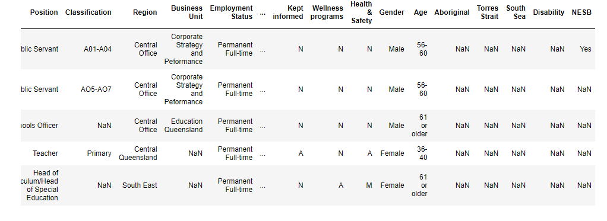

Remove columns that we don't need for our analysis:
```
dete_survey_updated = dete_survey.drop(dete_survey.columns[28:49], axis=1)
tafe_survey_updated = tafe_survey.drop(tafe_survey.columns[17:66], axis=1)
```
In this case we do not need the following column indexes, __28-49__ in `dete_survey`, and __17-66__ in `tafe_survey`.

__Clean Column Names__
```
dete_survey_updated.columns = dete_survey_updated.columns.str.lower().str.strip().str.replace(' ', '_')
```
Running this line of code updates all column names to lowercase using `str.lower()`, remove leading and trailing whitespaces `str.strip()`, and replace all spaces with `_` using `str.replace(' ', '_')`

We can check the new column names by running:
```
dete_survey_updated.columns
```

Next in order to correlate the data from each dataset we will need to make sure that the column names match. 

To do this we can run the code:
```
mapping = {'Record ID': 'id', 'CESSATION YEAR': 'cease_date', 'Reason for ceasing employment': 'separationtype', 'Gender. What is your Gender?': 'gender', 'CurrentAge. Current Age': 'age',
       'Employment Type. Employment Type': 'employment_status',
       'Classification. Classification': 'position',
       'LengthofServiceOverall. Overall Length of Service at Institute (in years)': 'institute_service',
       'LengthofServiceCurrent. Length of Service at current workplace (in years)': 'role_service'}
```
```
tafe_survey_updated = tafe_survey_updated.rename(mapping, axis = 1)
```

Here are the updates column names for both datasets:

__DETE Survey__

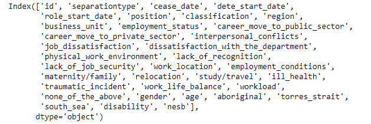

__TAFE Surevey__

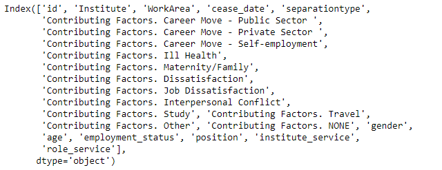

__Filter the Data__

Check the unique values for the `separationype` column in both datasets.

```
tafe_survey_updated['separationtype'].value_counts()
```

```
dete_survey_updated['separationtype'].value_counts()
```

Here we can see that the resignation value is lowercase, we need to update all separation types in the dete survey containg the word __"resignation"__ to just __'Resignation'__ to match the tefe survey value.

```
dete_survey_updated['separationtype'] = dete_survey_updated['separtiontype'].str.split('-').str[0]
```

We are using the deliminter "-" in this case.

Check to see if the values in the `separationtype` were updated correctly:

```
dete_survey_updated['separtiontype'].value_counts()
```

Here is a before and after of the separtion types:

__Before__

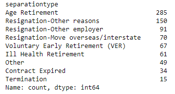

__After__

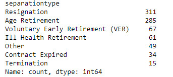

We can see that this was able to contain all 3 separation types containing the work "Resignation", similar to how the tefe data is.

We will now only select the resignation separation types from each dataframe.
```
dete_resignations = dete_survey_updated[dete_survey_update['separationtype'] == 'Resignation'].copy()
```
```
tafe_resignations = tafe_survey_updated[tafe_survey_update['separationtype'] == 'Resignation'].copy()
```

__Verify the Data__

Here we will verify that the data doesn't contain any major inconsistencies.

We will clean and explore the `cease_date` and `dete_start_date` columns to make sure all of the years make sense.
* Since the `cease_date` is the last year of the person's employment and the `dete_start_date` is the person's first year of employment, there's no reason to have years after the current date.
* Given that most people in this field start workng in their 20s, it's also unlikely that the `dete_start_date` was before the year __1940__.

First we will check the unique values:
```
dete_resignations['cease_date'].value_counts()
```

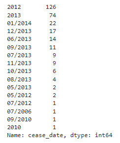

Next we extract the __years__ and convert them to a float type:

```
dete_resignations['cease_date'] = dete_resignations['cease_date'].str.split('/').str[-1]

dete_resignations['cease_date'] = dete_resignations['cease_date'].astype("float")
```
```
# Check the values again and look for outliers
dete_resignations['cease_date'].value_counts()
```

The values for the `cease_date` column now look like:

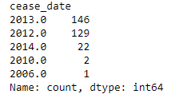

We will also look into the unique values for the `dete_start_date` column:
```
dete_resignations['dete_start_date'].value_counts().sort_values()
```

Also checking the unique values of the tafe dataset:
```
tafe_resignations'[cease_date'].value_counts().sort_values()
```

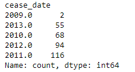

Here is what we have found:
* The years in both dataframes don't completely align
* The `tafe_survey_updated` dataframe contains some cease dated in 2009, but the `dete_survey_updated` dataframe does not
* The `tafe_survey_updated` dataframs also contains many more cease dates in 2010 than the `dete_survey_updated` dataframe

__Create a new Column__

We need a column containing the length of time an empployee spend in their workplace, years of service, in both dataframes.

Question:
<center>__
Are employees who only worked for the institutes for a short period of time resigning due to some kind of dissatisfaction? What about employees who have been there longer?
</center>

We now need to calculate the years of service in the `dete_survey_updated` dataframe by subtracting the `dete_start_date` form the `cease_date` and create a new column named `institute_service` (tafe_servey already has this column)

```
dete_resignations['institute_service'] = dete_resignations['cease_date'] - dete_resinations['dete_start_date']
```

If we check the result we get:
```
dete_resignations['institute_service'].head()
```

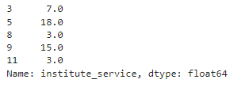

__Identify Dissatisfies Employees__

Below are the columns that we'll use to categorize employees as "dissatisfied" from each dataframe:

1. tafe_survey_updated
- Contributing Factors. Dissatisfaction
- Contributing Factors. Job Dissatisfaction
2. dafe_survey_updated
- job_dissatisfaction
- dissatisfacton_with_the_department
- physical_work_enviroment
- lack_of_recognition
- lack_of_job_security
- work_location
- employment_conditions
- work_life_balance
- workload

If the employee indicated that one of those caused them to resign, we'll mark them as dissatisfied in a new column.

The new dissatisfied column will contain just the following values:
- __True:__ indicates a person resigned because they were dissatisfied in some way
- __False:__ indicates a person resigned because of a reason other than dissatisfaction with the job
- __NaN:__ indicates the value is missing

We will firest check the unique values of the `tafe_survey_updated` dataframe
```
tafe_resignations['Contributing Factors. Dissatisfaction'].value_counts()
```
```
tafe_resignations['Contributing Factors. Job Dissatisfaction'].value_counts()
```

We will then update the values in the contributing factors to be either, __True__, __False__, or __NaN__

```
def update_vals(x):
    if x == '-':
        return False
    elif pd.isnull(x):
        return np.nan
    else:
        return True
tafe_resignations['dissatisfied'] = tafe_resignations[['Contributing Factors. Dissatisfaction', 'Contributing Factors. Job Dissatisfaction']].applymap(update_vals).any(1, skipna=False)
tafe_resignations_up = tafe_resignations.copy()
```
Check the unique values after the updates:
```
tafe_resignations_up['dissatisfied'].value_counts(dropna=False)
```

Now let's do this for the dete_survey dataset
```
# Update the values in columns related to dissatisfaction to be either True, False, or NaN
dete_resignations['dissatisfied'] = dete_resignations[['job_dissatisfaction',
       'dissatisfaction_with_the_department', 'physical_work_environment',
       'lack_of_recognition', 'lack_of_job_security', 'work_location',
       'employment_conditions', 'work_life_balance',
       'workload']].any(1, skipna=False)
dete_resignations_up = dete_resignations.copy()
dete_resignations_up['dissatisfied'].value_counts(dropna=False)
```

__Combine the Data__

We'll now add an institute column so that we can differentiate the data from __each survey__ after we combine them. Then, we'll combine the dataframes and drop any remaining columnds we don't need.

Add an institute column:
```
dete_resignations_up['institute'] = 'DETE'
tafe_resignations_up['institute'] = 'TAFE'
```

Now we will combine the dataframes:
```
combined = pd.concat([dete_resignations_up, tafe_resignations_up], ignore_index=True)
```
Then we need to check the non null values of each column and drop the columns with less than 500 non null values.
```
combined.notnull().sum().sort_values(ascending=False)
```
```
combined_updated = combined.dropna(thresh = 500, axis = 1).copy()
```

__Clean the service Column__

Next we will need to clean the institute_service column.

The employees will be categorized according to the followind definitions:
- __New:__ Less than 3 years in the workplace
- __Experienced:__ 3-6 years in the workplace
- __Established__: 7-10 years in the workplace
- __Veteran:__ 11 or more years in the workplace

Check the unique values:
```
combined_updated['institute_service'].value_counts(dropna=False)
```

Extract the years of service and convert the datatype to float:
```
combined_updated['institute_service_up'] = combined_updated['institute_service'].astype('str').str.extract(r'(\d+)')
combined_updated['institute_service_up'] = combined_updated['institute_service_up'].astype('float')

# Check that the years extracted are correct
combined_updated['institute_service_up'].value_counts()
```
Now we will convert the years of service into categories

```
# Convert years of service to categories
def transform_service(val):
    if val >= 11:
        return "Veteran"
    elif 7 <= val < 11:
        return "Established"
    elif 3 <= val < 7:
        return "Experienced"
    elif pd.isnull(val):
        return np.nan
    else:
        return "New"
combined_updated['service_cat'] = combined_updated['institute_service_up'].apply(transform_service)

# Quick check of the update
combined_updated['service_cat'].value_counts()
```

Here are the results:

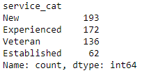

## Analyze and Share

__Perform Intial Analysis__

We will now replace the missing values in the dissatisfied column with the most frequent value, False. The percentage of employees who resigned due to dissatisfaction in each `service_cat` group will be found and we will also plot the results for this.

This is meant to be an intial introduction to the analysis, not the final analysis as we still have additional missing values left to deal with.

Let's first verify the unique values:

```
combine_updated['dissatisfied'].value_counts(dropna=False)
```
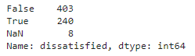

Then let's replace the missing values with the most frequent value, False:

```
combine_updated['dissatisfied'] = combine_updated['dissatisfied'].fillna(False)
```
Next we will calculate the percentage of employees who resigned due to dissatifaction in each category.

```
dis_pct = combined_updated.pivot_table(index='service_cat', values='dissatisfied')
```

Plotting the Results:

```
%matplotlib inline
dis_pct.plot(kind='bar', rot=30)
```

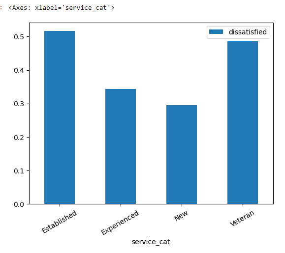

Looking at the analysis and the plot from above, we can conclude that employees with 7 or more years of service are more likely to resign due to some kind of dissatifacation with the job than employees with less than 7 years of service.

We will need to handle the rest of the missing data to finalize our analysis.

In this guided project (from __DataQuest__), we experienced that in order to extract any meaningful insights from our data, we had to perform many data cleaning tasks. In order to create one visualization (and not even the final one), we completed the following tasks:

- Explored the data and figured out how to prepare it for analysis
- Corrected some of the missing values
- Dropped any data not needed for our analysis
- Renamed our columns
- Verified the quality of our data
- Created a new institute_service column
- Cleaned the Contributing Factors columns
- Created a new column indicating if an employee resigned because they were dissatisfied in some way
- Combined the data
- Cleaned the institute_service column
- Handled the missing values in the dissatisfied column
- Aggregated the data
